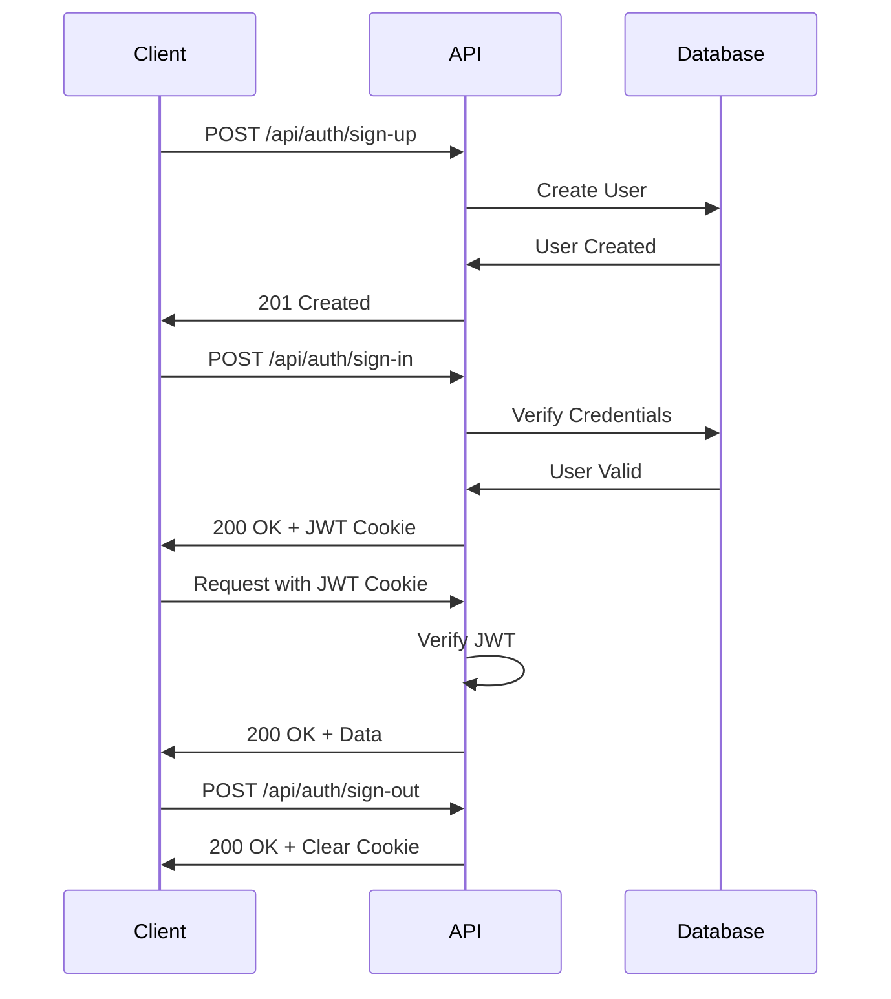

# 📡 API Reference

<div align="center">

## Complete API Documentation

**Acquisitions API v1.0.0**

Comprehensive guide to all available endpoints, request/response formats, and authentication.

[Authentication](#-authentication) • [Users](#-users) • [Health](#-health--status) • [Errors](#-error-handling)

</div>

---

## 🌐 Base URL

```
Development:  http://localhost:5000
Production:   https://your-domain.com
```

---

## 🔐 Authentication

All authentication endpoints use JWT (JSON Web Tokens) for secure authentication.

### Overview



---

### 🆕 Sign Up

Create a new user account.

**Endpoint:** `POST /api/auth/sign-up`

**Headers:**

```http
Content-Type: application/json
```

**Request Body:**

```json
{
  "name": "John Doe",
  "email": "john@example.com",
  "password": "securePassword123",
  "role": "user"
}
```

**Parameters:**

| Field      | Type   | Required | Constraints                | Description                 |
| ---------- | ------ | -------- | -------------------------- | --------------------------- |
| `name`     | string | ✅ Yes   | 2-255 chars                | User's full name            |
| `email`    | string | ✅ Yes   | Valid email, max 255 chars | User's email address        |
| `password` | string | ✅ Yes   | 6-128 chars                | User's password             |
| `role`     | string | ❌ No    | 'user' or 'admin'          | User role (default: 'user') |

**Response:** `201 Created`

```json
{
  "message": "User registered successfully",
  "user": {
    "id": "550e8400-e29b-41d4-a716-446655440000",
    "name": "John Doe",
    "email": "john@example.com",
    "role": "user",
    "createdAt": "2025-10-23T12:00:00.000Z"
  }
}
```

**cURL Example:**

```bash
curl -X POST http://localhost:5000/api/auth/sign-up \
  -H "Content-Type: application/json" \
  -d '{
    "name": "John Doe",
    "email": "john@example.com",
    "password": "securePassword123",
    "role": "user"
  }'
```

**JavaScript Example:**

```javascript
const response = await fetch('http://localhost:5000/api/auth/sign-up', {
  method: 'POST',
  headers: {
    'Content-Type': 'application/json',
  },
  body: JSON.stringify({
    name: 'John Doe',
    email: 'john@example.com',
    password: 'securePassword123',
    role: 'user',
  }),
});

const data = await response.json();
console.log(data);
```

**Error Responses:**

<details>
<summary><b>400 Bad Request - Validation Error</b></summary>

```json
{
  "error": "Validation failed",
  "details": [
    {
      "field": "email",
      "message": "Invalid email"
    },
    {
      "field": "password",
      "message": "String must contain at least 6 character(s)"
    }
  ]
}
```

</details>

<details>
<summary><b>409 Conflict - Email Already Exists</b></summary>

```json
{
  "error": "Email already exist"
}
```

</details>

---

### 🔑 Sign In

Authenticate user and receive JWT token.

**Endpoint:** `POST /api/auth/sign-in`

**Headers:**

```http
Content-Type: application/json
```

**Request Body:**

```json
{
  "email": "john@example.com",
  "password": "securePassword123"
}
```

**Parameters:**

| Field      | Type   | Required | Constraints | Description          |
| ---------- | ------ | -------- | ----------- | -------------------- |
| `email`    | string | ✅ Yes   | Valid email | User's email address |
| `password` | string | ✅ Yes   | Min 6 chars | User's password      |

**Response:** `200 OK`

```json
{
  "message": "Signed in successfully",
  "user": {
    "id": "550e8400-e29b-41d4-a716-446655440000",
    "name": "John Doe",
    "email": "john@example.com",
    "role": "user"
  }
}
```

**Sets Cookie:**

```http
Set-Cookie: token=eyJhbGciOiJIUzI1NiIsInR5cCI6IkpXVCJ9...; HttpOnly; Secure; SameSite=Strict; Max-Age=604800; Path=/
```

**Cookie Properties:**

- `HttpOnly`: Prevents JavaScript access
- `Secure`: HTTPS only (in production)
- `SameSite=Strict`: CSRF protection
- `Max-Age=604800`: 7 days expiration

**cURL Example:**

```bash
curl -X POST http://localhost:5000/api/auth/sign-in \
  -H "Content-Type: application/json" \
  -c cookies.txt \
  -d '{
    "email": "john@example.com",
    "password": "securePassword123"
  }'
```

**JavaScript Example:**

```javascript
const response = await fetch('http://localhost:5000/api/auth/sign-in', {
  method: 'POST',
  headers: {
    'Content-Type': 'application/json',
  },
  credentials: 'include', // Important for cookies
  body: JSON.stringify({
    email: 'john@example.com',
    password: 'securePassword123',
  }),
});

const data = await response.json();
console.log(data);
```

**Error Responses:**

<details>
<summary><b>400 Bad Request - Validation Error</b></summary>

```json
{
  "error": "Validation failed",
  "details": [
    {
      "field": "email",
      "message": "Invalid email"
    }
  ]
}
```

</details>

<details>
<summary><b>401 Unauthorized - Invalid Credentials</b></summary>

```json
{
  "error": "Invalid credentials"
}
```

</details>

---

### 🚪 Sign Out

Sign out user and clear JWT token.

**Endpoint:** `POST /api/auth/sign-out`

**Headers:**

```http
Cookie: token=your-jwt-token
```

**Request Body:** None

**Response:** `200 OK`

```json
{
  "message": "Signed out successfully"
}
```

**Clears Cookie:**

```http
Set-Cookie: token=; HttpOnly; Secure; SameSite=Strict; Max-Age=0; Path=/
```

**cURL Example:**

```bash
curl -X POST http://localhost:5000/api/auth/sign-out \
  -b cookies.txt
```

**JavaScript Example:**

```javascript
const response = await fetch('http://localhost:5000/api/auth/sign-out', {
  method: 'POST',
  credentials: 'include', // Important for cookies
});

const data = await response.json();
console.log(data);
```

---

## 👥 Users

Endpoints for user management.

### 📋 Get All Users

Retrieve a list of all users (passwords excluded).

**Endpoint:** `GET /api/users`

**Headers:** None required

**Query Parameters:** None

**Response:** `200 OK`

```json
{
  "message": "Successfully retrieved users",
  "count": 2,
  "users": [
    {
      "id": "550e8400-e29b-41d4-a716-446655440000",
      "name": "John Doe",
      "email": "john@example.com",
      "role": "user",
      "createdAt": "2025-10-23T12:00:00.000Z"
    },
    {
      "id": "550e8400-e29b-41d4-a716-446655440001",
      "name": "Jane Smith",
      "email": "jane@example.com",
      "role": "admin",
      "createdAt": "2025-10-23T11:00:00.000Z"
    }
  ]
}
```

**cURL Example:**

```bash
curl http://localhost:5000/api/users
```

**JavaScript Example:**

```javascript
const response = await fetch('http://localhost:5000/api/users');
const data = await response.json();
console.log(data);
```

---

### 👤 Get User by ID

Retrieve a specific user by their ID.

**Endpoint:** `GET /api/users/:id`

**URL Parameters:**

| Parameter | Type   | Required | Description                     |
| --------- | ------ | -------- | ------------------------------- |
| `id`      | string | ✅ Yes   | User's unique identifier (UUID) |

**Response:** `200 OK`

```json
{
  "message": "User retrieved successfully",
  "user": {
    "id": "550e8400-e29b-41d4-a716-446655440000",
    "name": "John Doe",
    "email": "john@example.com",
    "role": "user",
    "createdAt": "2025-10-23T12:00:00.000Z"
  }
}
```

**cURL Example:**

```bash
curl http://localhost:5000/api/users/550e8400-e29b-41d4-a716-446655440000
```

**JavaScript Example:**

```javascript
const userId = '550e8400-e29b-41d4-a716-446655440000';
const response = await fetch(`http://localhost:5000/api/users/${userId}`);
const data = await response.json();
console.log(data);
```

**Error Responses:**

<details>
<summary><b>404 Not Found - User Not Found</b></summary>

```json
{
  "error": "User not found"
}
```

</details>

---

## 🏥 Health & Status

### ⚡ Health Check

Check if the API is running and healthy.

**Endpoint:** `GET /health`

**Response:** `200 OK`

```json
{
  "status": "OK",
  "timestamp": "2025-10-23T12:00:00.000Z",
  "uptime": 42.5
}
```

**Response Fields:**

| Field       | Type   | Description                    |
| ----------- | ------ | ------------------------------ |
| `status`    | string | Server health status ("OK")    |
| `timestamp` | string | Current server time (ISO 8601) |
| `uptime`    | number | Server uptime in seconds       |

**cURL Example:**

```bash
curl http://localhost:5000/health
```

---

### 🌐 API Status

Get API status message.

**Endpoint:** `GET /api`

**Response:** `200 OK`

```json
{
  "message": "Acquisitions API is running!"
}
```

**cURL Example:**

```bash
curl http://localhost:5000/api
```

---

### 👋 Welcome

Get welcome message.

**Endpoint:** `GET /`

**Response:** `200 OK`

```
Hello, from acquisitions app!
```

**cURL Example:**

```bash
curl http://localhost:5000/
```

---

## 🚨 Error Handling

### Standard Error Response

All errors follow this format:

```json
{
  "error": "Error type",
  "message": "Detailed error message",
  "details": "Additional information (optional)"
}
```

### HTTP Status Codes

| Code | Name                  | Description                               |
| ---- | --------------------- | ----------------------------------------- |
| 200  | OK                    | Request successful                        |
| 201  | Created               | Resource created successfully             |
| 400  | Bad Request           | Invalid request data                      |
| 401  | Unauthorized          | Authentication required                   |
| 403  | Forbidden             | Insufficient permissions                  |
| 404  | Not Found             | Resource not found                        |
| 409  | Conflict              | Resource conflict (e.g., duplicate email) |
| 429  | Too Many Requests     | Rate limit exceeded                       |
| 500  | Internal Server Error | Server error                              |

### Common Errors

<details>
<summary><b>400 Bad Request - Validation Error</b></summary>

Returned when input validation fails.

```json
{
  "error": "Validation failed",
  "details": [
    {
      "field": "email",
      "message": "Invalid email"
    },
    {
      "field": "password",
      "message": "String must contain at least 6 character(s)"
    }
  ]
}
```

</details>

<details>
<summary><b>401 Unauthorized - Invalid Credentials</b></summary>

Returned when authentication fails.

```json
{
  "error": "Invalid credentials"
}
```

</details>

<details>
<summary><b>404 Not Found - Route Not Found</b></summary>

Returned when endpoint doesn't exist.

```json
{
  "error": "Not Found",
  "message": "Cannot GET /api/nonexistent"
}
```

</details>

<details>
<summary><b>409 Conflict - Email Already Exists</b></summary>

Returned when trying to create user with existing email.

```json
{
  "error": "Email already exist"
}
```

</details>

<details>
<summary><b>429 Too Many Requests - Rate Limited</b></summary>

Returned when rate limit is exceeded.

```json
{
  "error": "Too Many Requests",
  "message": "Rate limit exceeded. Please try again later.",
  "retryAfter": 60
}
```

</details>

<details>
<summary><b>500 Internal Server Error</b></summary>

Returned when server encounters an error.

```json
{
  "error": "Internal Server Error",
  "message": "An unexpected error occurred"
}
```

</details>

---

## 🔒 Security Features

### Rate Limiting

API endpoints are protected with rate limiting:

| Endpoint Type     | Rate Limit  | Window   |
| ----------------- | ----------- | -------- |
| Auth endpoints    | 5 requests  | 1 minute |
| User endpoints    | 10 requests | 1 minute |
| General endpoints | 20 requests | 1 minute |

When rate limited, you'll receive:

```json
{
  "error": "Too Many Requests",
  "message": "Rate limit exceeded",
  "retryAfter": 60
}
```

**Headers:**

```http
X-RateLimit-Limit: 5
X-RateLimit-Remaining: 0
X-RateLimit-Reset: 1635000000
Retry-After: 60
```

### Bot Detection

Arcjet automatically detects and blocks:

- 🤖 Automated bots
- 🕷️ Web scrapers
- 🚫 Malicious traffic
- 💥 DDoS attacks

### Security Headers

All responses include security headers:

```http
X-Content-Type-Options: nosniff
X-Frame-Options: DENY
X-XSS-Protection: 1; mode=block
Strict-Transport-Security: max-age=31536000; includeSubDomains
Content-Security-Policy: default-src 'self'
```

---

## 📦 Response Formats

### Success Response

```json
{
  "message": "Operation successful",
  "data": {
    /* response data */
  }
}
```

### Error Response

```json
{
  "error": "Error Type",
  "message": "Detailed error message",
  "details": {
    /* additional error details */
  }
}
```

### List Response

```json
{
  "message": "Items retrieved successfully",
  "count": 10,
  "items": [
    /* array of items */
  ]
}
```

---

## 🧪 Testing the API

### Using cURL

```bash
# Sign up
curl -X POST http://localhost:5000/api/auth/sign-up \
  -H "Content-Type: application/json" \
  -d '{"name":"John","email":"john@test.com","password":"test123"}'

# Sign in and save cookie
curl -X POST http://localhost:5000/api/auth/sign-in \
  -H "Content-Type: application/json" \
  -c cookies.txt \
  -d '{"email":"john@test.com","password":"test123"}'

# Get users with cookie
curl http://localhost:5000/api/users \
  -b cookies.txt

# Sign out
curl -X POST http://localhost:5000/api/auth/sign-out \
  -b cookies.txt
```

### Using Postman

1. Import collection from `postman_collection.json`
2. Set base URL: `http://localhost:5000`
3. For authenticated requests:
   - Sign in first
   - Cookie will be automatically saved
   - Subsequent requests will use the cookie

### Using JavaScript/Fetch

```javascript
// Base configuration
const baseURL = 'http://localhost:5000';
const headers = {
  'Content-Type': 'application/json',
};

// Sign up
const signUp = async () => {
  const response = await fetch(`${baseURL}/api/auth/sign-up`, {
    method: 'POST',
    headers,
    body: JSON.stringify({
      name: 'John Doe',
      email: 'john@example.com',
      password: 'securePassword123',
    }),
  });
  return response.json();
};

// Sign in
const signIn = async () => {
  const response = await fetch(`${baseURL}/api/auth/sign-in`, {
    method: 'POST',
    headers,
    credentials: 'include', // Important!
    body: JSON.stringify({
      email: 'john@example.com',
      password: 'securePassword123',
    }),
  });
  return response.json();
};

// Get users (authenticated)
const getUsers = async () => {
  const response = await fetch(`${baseURL}/api/users`, {
    credentials: 'include', // Important!
  });
  return response.json();
};
```

---

## 📚 Additional Resources

- [Main Documentation](./README.md)
- [Docker Setup](./DOCKER_SETUP.md)
- [Contributing Guide](./CONTRIBUTING.md)
- [Testing Guide](./tests/README.md)

---

<div align="center">

**Need help?** [Open an issue](https://github.com/ayushh9999/acquisitions/issues)

Built with ❤️ by [Ayush Mondal](https://github.com/ayushh9999)

</div>
