# 🏗️ Architecture Documentation

<div align="center">

## System Architecture & Design

**Comprehensive architecture overview of Acquisitions API**

[System Overview](#-system-overview) • [Component Design](#-component-design) • [Data Flow](#-data-flow) • [Security](#-security-architecture)

</div>

---

## 📊 System Overview

### High-Level Architecture

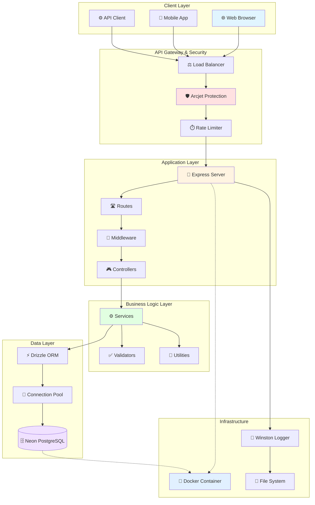

---

## 🧩 Component Design

### Layer Architecture

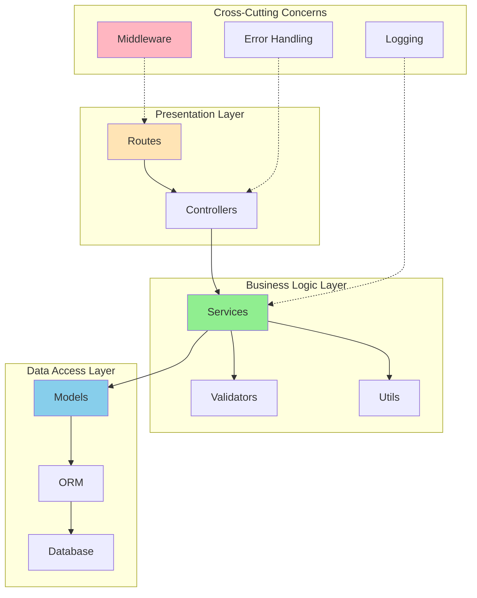

### Component Breakdown

| Layer              | Components                                 | Responsibilities                          |
| ------------------ | ------------------------------------------ | ----------------------------------------- |
| 🌐 **Routes**      | `auth.routes.js`, `user.routes.js`         | Define API endpoints, HTTP methods        |
| 🎮 **Controllers** | `auth.controller.js`, `user.controller.js` | Handle requests, send responses           |
| ⚙️ **Services**    | `auth.service.js`, `users.service.js`      | Business logic, data operations           |
| 🗄️ **Models**      | `user.model.js`                            | Database schemas, table definitions       |
| 🛡️ **Middleware**  | `security.middleware.js`                   | Authentication, authorization, protection |
| ✅ **Validators**  | `auth.validation.js`                       | Input validation, schema validation       |
| 🔧 **Utils**       | `jwt.js`, `cookies.js`, `format.js`        | Helper functions, utilities               |
| ⚙️ **Config**      | `database.js`, `logger.js`, `arcjet.js`    | Configuration management                  |

---

## 🔄 Data Flow

### Request-Response Flow

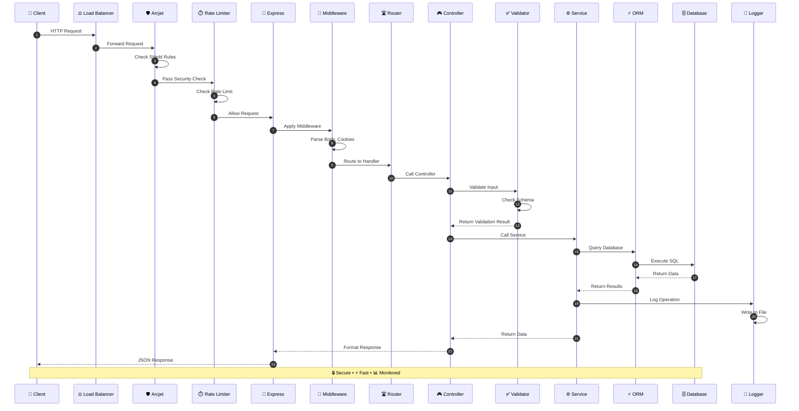

### Authentication Flow

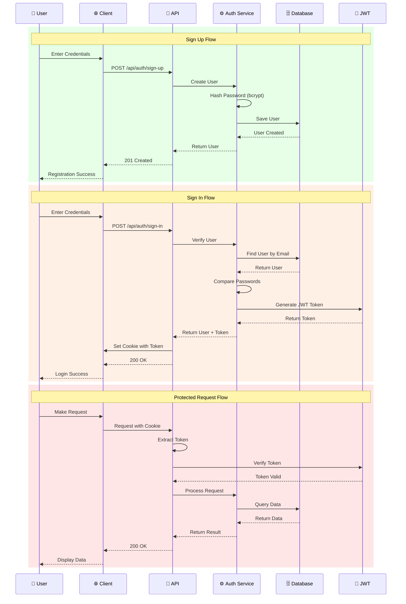

---

## 🔒 Security Architecture

### Security Layers

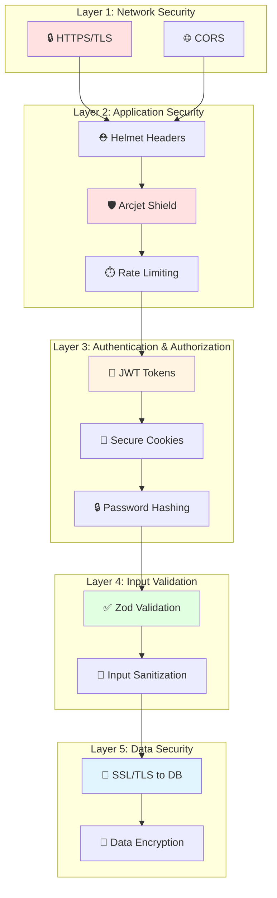

### Security Features

| Feature                 | Implementation           | Protection Against                |
| ----------------------- | ------------------------ | --------------------------------- |
| 🔒 **HTTPS**            | TLS 1.3                  | Man-in-the-middle attacks         |
| ⛑️ **Helmet**           | Security headers         | XSS, clickjacking, MIME sniffing  |
| 🛡️ **Arcjet Shield**    | Bot detection & blocking | Bots, scrapers, malicious traffic |
| ⏱️ **Rate Limiting**    | Request throttling       | DDoS, brute force attacks         |
| 🔑 **JWT**              | Token-based auth         | Unauthorized access               |
| 🍪 **HttpOnly Cookies** | Secure cookie storage    | XSS attacks                       |
| 🔒 **bcrypt**           | Password hashing         | Rainbow table attacks             |
| ✅ **Zod Validation**   | Input validation         | SQL injection, XSS                |
| 🔐 **SSL to DB**        | Encrypted connection     | Data interception                 |

---

## 🗄️ Database Architecture

### Schema Design

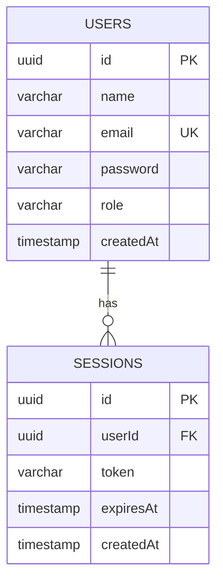

### User Model Structure

```javascript
// user.model.js - Drizzle Schema
{
  id: uuid('id').defaultRandom().primaryKey(),
  name: varchar('name', { length: 255 }).notNull(),
  email: varchar('email', { length: 255 }).notNull().unique(),
  password: varchar('password', { length: 255 }).notNull(),
  role: varchar('role', { length: 50 }).default('user'),
  createdAt: timestamp('created_at').defaultNow()
}
```

### Database Connection Flow

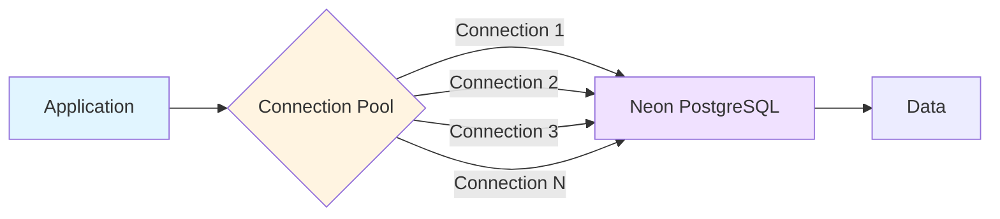

---

## 🐳 Deployment Architecture

### Docker Architecture

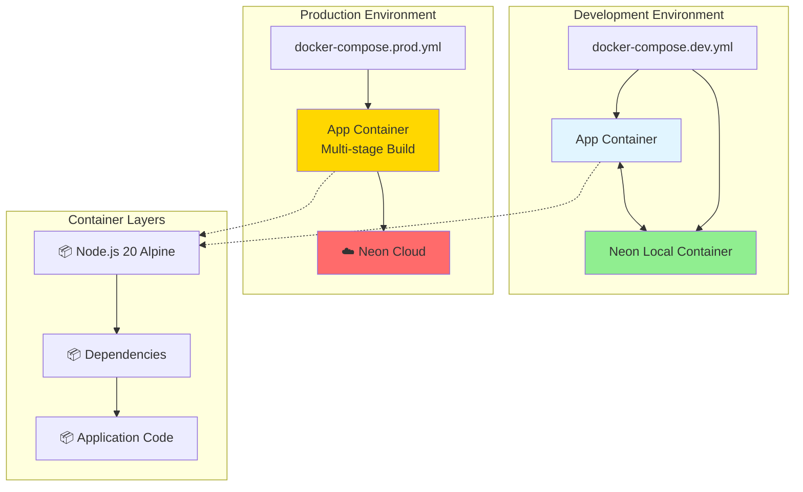

### Multi-Stage Docker Build

```dockerfile
# Stage 1: Base
FROM node:20-alpine AS base
WORKDIR /app

# Stage 2: Dependencies
FROM base AS deps
COPY package*.json ./
RUN npm ci

# Stage 3: Builder
FROM base AS builder
COPY --from=deps /app/node_modules ./node_modules
COPY . .

# Stage 4: Production
FROM base AS runner
COPY --from=builder /app .
EXPOSE 5000
CMD ["node", "src/index.js"]
```

---

## 📊 Monitoring & Logging

### Logging Architecture

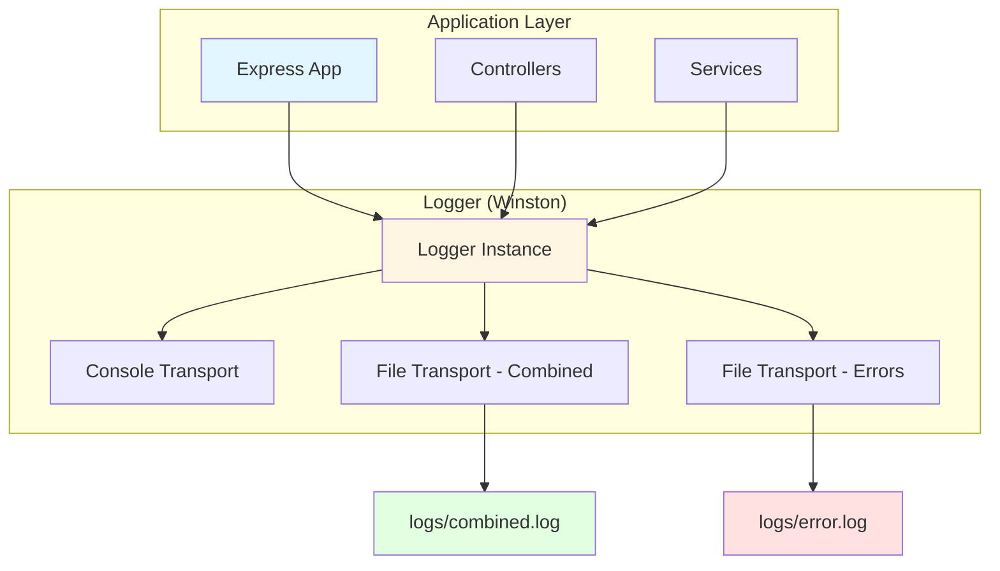

### Log Levels

| Level        | Purpose         | Example                     |
| ------------ | --------------- | --------------------------- |
| 🔴 **error** | Critical errors | Database connection failed  |
| ⚠️ **warn**  | Warnings        | Deprecated API usage        |
| ℹ️ **info**  | General info    | Server started on port 5000 |
| 🔍 **debug** | Debug info      | Query execution details     |

---

## 🚀 Performance Optimization

### Caching Strategy

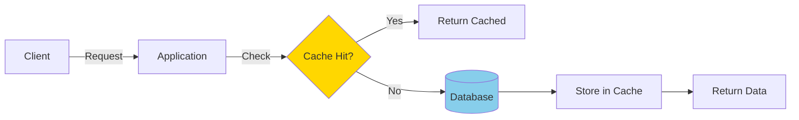

### Connection Pooling

- **Min Connections**: 2
- **Max Connections**: 10
- **Idle Timeout**: 30s
- **Connection Timeout**: 10s

### Query Optimization

```javascript
// ✅ Good: Selective fields
const users = await db
  .select({
    id: usersTable.id,
    name: usersTable.name,
    email: usersTable.email,
  })
  .from(usersTable);

// ❌ Bad: Select all fields
const users = await db.select().from(usersTable);
```

---

## 🔧 Technology Stack Details

### Runtime Environment

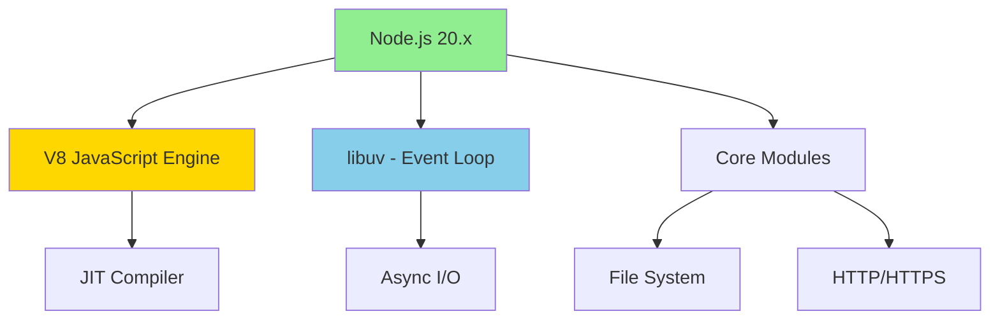

### Dependency Graph

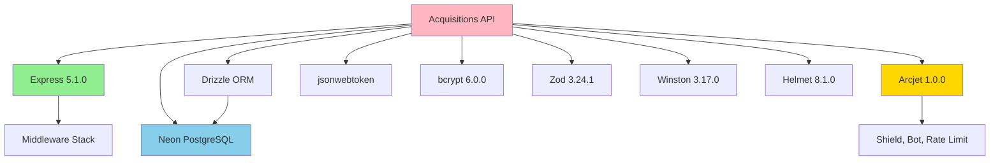

---

## 📈 Scalability

### Horizontal Scaling

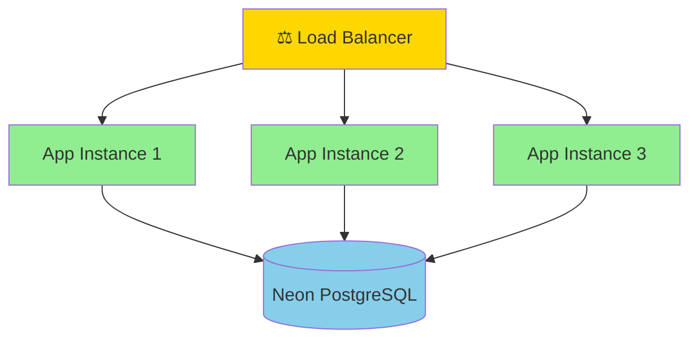

### Vertical Scaling

| Resource    | Development | Production |
| ----------- | ----------- | ---------- |
| CPU         | 1 core      | 2-4 cores  |
| RAM         | 512 MB      | 2-4 GB     |
| Disk        | 10 GB       | 50-100 GB  |
| Connections | 10          | 50-100     |

---

## 🔍 API Gateway Pattern

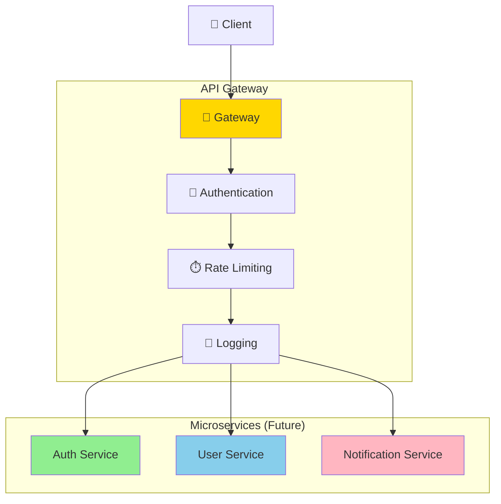

---

## 📚 Additional Resources

- [Main Documentation](./README.md)
- [API Reference](./API_REFERENCE.md)
- [Contributing Guide](./CONTRIBUTING.md)
- [Docker Setup](./DOCKER_SETUP.md)

---

<div align="center">

**Questions?** [Open an issue](https://github.com/ayushh9999/acquisitions/issues)

Built with ❤️ by [Ayush Mondal](https://github.com/ayushh9999)

</div>
